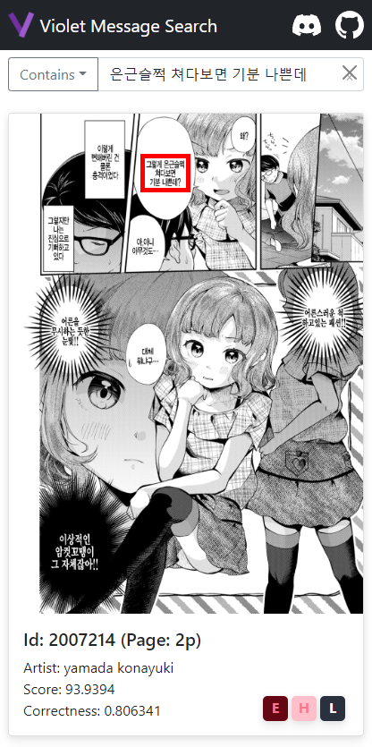

# Violet Message Search Local



## How To Use?

1. Install node.js & gallery-dl
2. Extract https://github.com/project-violet/violet-message-search-local/releases/download/0.1/dist.zip
3. Run run.bat, run-server.bat
4. Open http://localhost:6974/home/ in browser!

## Default Settings

```
fscm:
  IP: localhost
  PORT: 8864
vms-server:
  IP: localhost
  PORT: 6974
```