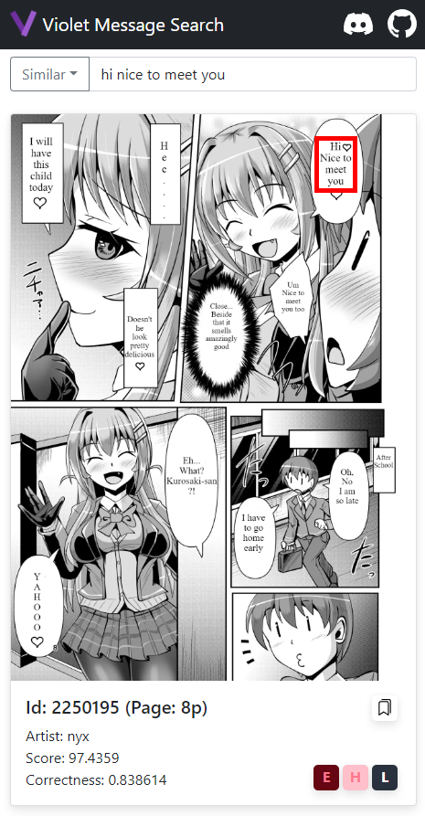

# Violet Message Search Local



## How To Use?

1. Install node.js & gallery-dl
2. Extract [korean-build](https://github.com/project-violet/violet-message-search-local/releases/download/0.2/dist-kor.zip)(release ~2023.03) or [english-build](https://github.com/project-violet/violet-message-search-local/releases/download/0.1/dist-eng.zip)(beta)
3. Run run.bat, run-server.bat! If you want to use this on macOS or linux, you must build [fast-search](https://github.com/project-violet/violet-message-search-core/tree/master/fast-search) yourself.
4. Open http://localhost:8088/home/ in browser!

You can see the latest database list here.
https://drive.google.com/drive/folders/1oWBiohoq5pntVhj34r-RwBsknPU7aeSE

## How does it work?

See [violet-message-search-core](https://github.com/project-violet/violet-message-search-core)

## Default Settings

```
fscm:
  IP: localhost
  PORT: 8864
vms-server:
  IP: localhost
  PORT: 8088
```

## ElasticSearch Only

```sh
# Set vm.max_map_count to 26144
wsl -d docker-desktop
sysctl -w vm.max_map_count=262144
exit

# Run elasticsearch
docker pull docker.elastic.co/elasticsearch/elasticsearch:8.2.0
docker network create elastic
docker run --name es01 --net elastic -p 9200:9200 -p 9300:9300 -it docker.elastic.co/elasticsearch/elasticsearch:8.2.0

# install CA
docker cp es01:/usr/share/elasticsearch/config/certs/http_ca.crt .

# Test
goto http://localhost:9200/ with u:elastic, p:
```

## ELK

```sh
# up
docker-compose -f ./docker-compose.yml up -d
or
docker-compose up -d

# down
docker-compose down

# elk
curl -XGET http://localhost:9200/_cat/indices?v
curl -XPOST http://localhost:9200/test/_doc/1 -H "Content-Type: application/json" -d @test.json -v
```

## Query

```
{
  "query": {
    "query_string": {
      "default_field": "Message",
      "query": "qhwl"
    }
  },
  "sort": {
    "ArticleId": "desc"
  }
}

GET /test/_search
{
  "query": {
    "fuzzy": {
      "Message": {
        "value": "clsduehdtod",
        "max_expansions": 150
      }
    }
  }
}

GET /test/_search
{
  "query": {
    "multi_match": {
      "query": "duehdtod",
      "fields": ["Message"],
      "fuzziness": 1
    }
  }
}

GET /test/_search
{
  "query": {
    "match": {
      "Message": {
        "query": "dmsrmstmfWjr",
        "fuzziness": "AUTO"
      }
    }
  }
}
```
