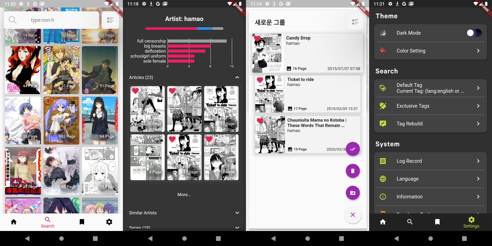

# Violet 



Project Violet Source Code

https://discord.gg/fqrtRxC

## How to build?

Go lib/main.dart and delete these

``` dart
void main() async {
  WidgetsFlutterBinding.ensureInitialized();
  await FlutterDownloader.initialize(
      debug: true // optional: set false to disable printing logs to console
      );
  FlareCache.doesPrune = false;

  Crashlytics.instance.enableInDevMode = true;
  FlutterError.onError = Crashlytics.instance.recordFlutterError;

  // Delete analytics methods [-
  analytics = FirebaseAnalytics();
  observer = FirebaseAnalyticsObserver(analytics: analytics);
  var id = (await SharedPreferences.getInstance()).getString('fa_userid');
  if (id == null) {
    var ii = sha1.convert(utf8.encode(DateTime.now().toString()));
    id = ii.toString();
    (await SharedPreferences.getInstance()).setString('fa_userid', id);
  }
  await analytics.setUserId(id);
  // -]

...
```

## Web App Support?

After making version 1.0.0, it will be ported to Web App.