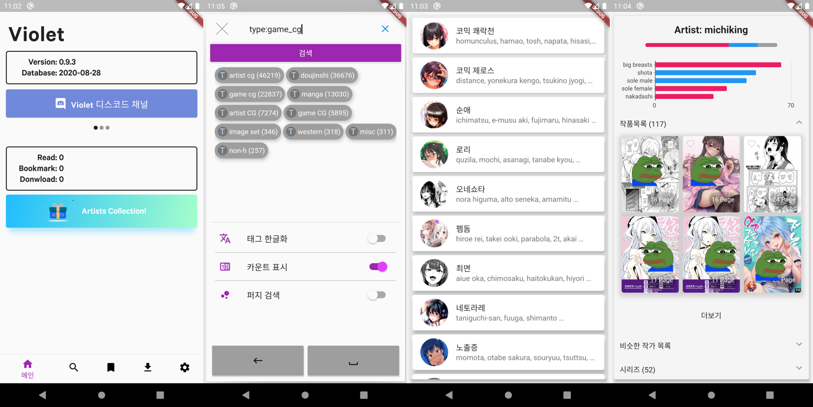
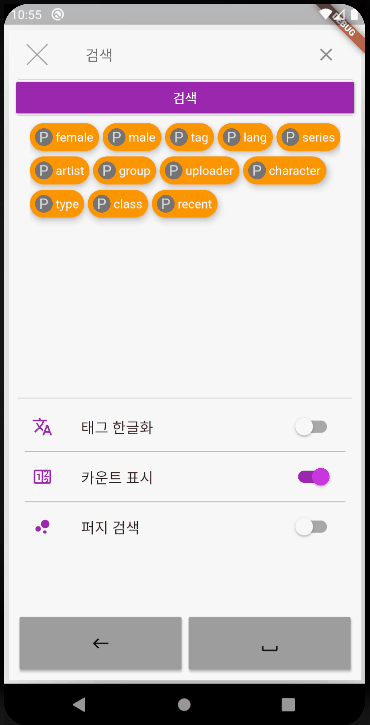
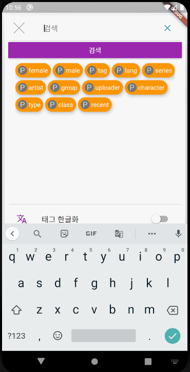
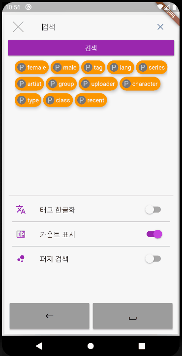
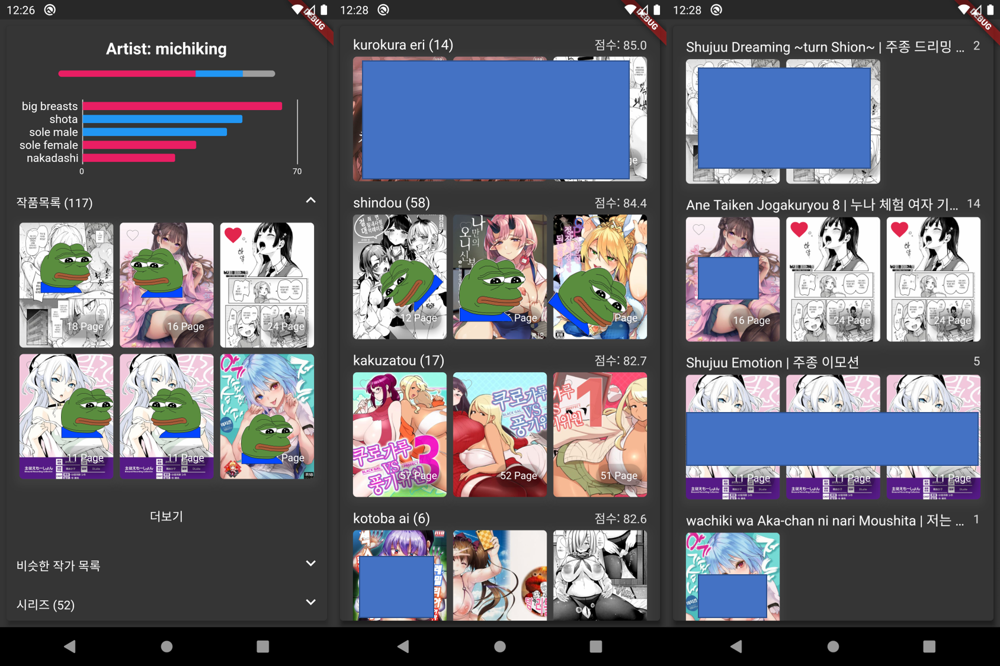
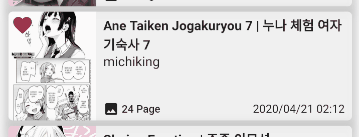
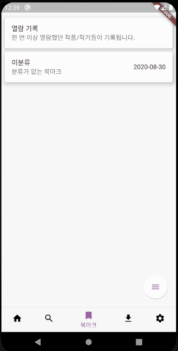

# Violet Manual [WIP]

The `Violet` application is a program designed to make it easy to access comic providing websites 
such as `E-Hentai`, `Ex-Hentai`, `Hitomi.la` and `nhentai`.

In this manual, we have tried to include all the descriptions of this project and app in as much detail as possible.
There is a lot of information that users may not need, so find only what you need.

## 0. Why is our name Violet?

`Violet` is a word taken from `Violation`.

The `Violet` app is the first sub-project of `Project Violet` and is an app developed around `Image Viewer`.

The second sub-project is `Project Violet Commnunity Downloader`.
This downloader is a program under development to easily download content from video websites, blogs, galleries and communities.
This app is posted on the Play Store and is completely free without ads.
https://play.google.com/store/apps/details?id=xyz.violet.communitydownloader

## 1. Useful Features

The `Violet` app (hereinafter `Violet`) has various functions in addition to the search and viewer.
All functions are actively managed.

1. Artists Collection
2. Detailed artist/group/uploader information
3. Artist recommendation (in implementation)
4. Tag search centered on auto-completion

## 2. Database Search and Web Search

`Violet` supports database search and web search as a way to search works.
Database search is a method of searching from pre-crawled data.
Web searches are exactly the same way they are searched directly on each website.

The reason for using database search is to provide quick search (queries below) and statistical information.
This app has a system that recommends writers/groups/uploaders with the most similar tendencies based on user reading records.
It also provides an easy way to navigate to writers/groups/uploaders who have similar tendencies to any author/group/uploader.

Database search has the disadvantage of not updating data in real time, so it's important to support real-time search.
Web search has been introduced as an additional search method.
Because it is difficult to perform queries with just web searches, only in the search section
Use web search and use database search for all remaining parts.

The database is currently being manually synchronized and is trying to upload it more than once every three days.

## 3. Searching

There are differences in the search form in each of the database search mode and web search mode.
Database search is based on the search method of `Hitomi.la`,
and web search follows the `E-Hentai` search method.

### 3.1. Common Search Form

If you are searching for any word, the search is based on whether the title contains that word.

`female` and `male`, `tag`, `lang`, `series`, `artist`, `group`, ʻuploader`, `character`, `type`, and `class` tokens for detailed search of works There are.
These tokens can be used when you want to limit the details of the works you want to search.
Each token is written before `:` like `female:blowjob`. What follows the `:` is the set element (tag) of each token.
If there is a tag with spaces in each token, the spaces must be replaced with `_`.

If you search for `female:blowjob`, only works that contain `female:blowjob` among the tags of the work are searched.
If you search with `-female:blowjob`, only works that do not contain `female:blowjob` among the tags of the work are searched.

All tokens can be combined ʻAnd` with spaces.
For example, if you search for `female:blowjob -female:footjob`, among the tags of the work, `female:blowjob` is included and works that do not include `female:footjob` are searched.

### 3.2. Database Search Form

Use a search method that includes parentheses and an `Or` search in the common search form.

You can search like `(female:blowjob or female:footjob) -(male:yaoi male:males_only)`.
This is to search for works that contain `female:blowjob` or `female:footjob` among the tags of the work, and do not include `male:yaoi` and `male:males_only`.

### 3.3. 웹 검색 양식

### 3.4. 검색어 자동완성

`Violet`에 구현된 자동완성 방식은 다른 앱들에 구현된 자동완성 방식들과 차이점이 있습니다.
자주 사용되는 토큰 및 태그들을 클릭 몇 번으로 쉽게 탐색할 수 있게 설계했습니다.
모든 태그들은 자주 사용되는 순으로 정렬됩니다.

하단에 배치된 백스페이스 버튼과 스페이스 버튼으로 쉽게 검색어들을 조합할 수 있습니다.

키보드로 직접 검색어를 입력하여 자동완성 목록을 찾는 것도 가능합니다.

퍼지 검색은 검색어와 일부만 일치하는 태그들을 탐색합니다.
이때 가장 일치하는 순서대로 태그들이 표시됩니다.

## 4. 작품 정보

검색 페이지나 다른 창들에서 표시되는 작품 썸네일을 탭하면 작품 정보를 상세하게 볼 수 있습니다.
작품 정보창에서 썸네일을 탭하면 꽉찬 화면으로 썸네일을 볼 수 있습니다.

`읽기` 버튼을 통해 작품을 볼 수 있으며, `다운로드` 버튼을 통해 작품을 다운로드할 수 있습니다.
작품을 다운로드하려는 경우 다운로드 전 반드시 다운로드 페이지를 로딩해야 합니다.

작가나 그룹, 업로더 태그 뱃지를 탭하면 해당 작가/그룹/업로더의 상세 정보 창으로 이동합니다.

댓글은 기본적으로 `E-Hentai`의 작품 댓글을 보여주며, 설정에서 `ExHentai` 로그인 정보를 입력한다면,
`ExHentai`의 작품 댓글을 보여줍니다.

미리보기는 작은 썸네일을 최대 30장까지 보여줍니다.

## 5. 작가/그룹/업로더 정보

작가 컬렉션이나 작품 정보창에서 작가/그룹/업로더(이하 작가) 정보를 열람할 수 있습니다.

위 세 사진 중 좌측 사진은 기본 정보창을 보여줍니다.
상단엔 작가 이름과 작품들의 태그 분포를 보여줍니다.
태그 분포를 탭하면 상세한 분포 그래프를 볼 수 있습니다.

중앙 사진은 비슷한 작가 목록 창을 보여줍니다.
가장 비슷한 작가, 점수 순으로 작가들을 나열해 보여줍니다.

우측 사진은 시리즈 목록을 보여줍니다.
비슷한 제목을 가진 작품들을 모아서 보여줍니다.

## 6. 북마크

### 6.1. 북마크 등록

 

작품썸네일을 길게 누르면 북마크를 등록/해제할 수 있습니다.
기본적으로 모든 북마크는 `미분류` 북마크 그룹에 등록됩니다.

### 6.2. 북마크 관리

북마크 페이지에서 북마크를 관리할 수 있습니다.

우측 하단 플로팅 버튼을 통해 북마크 그룹을 생성할 수 있고,
북마크 그룹을 길게 탭하여 북마크 그룹 정보를 수정할 수 있습니다.

우측 하단 플로팅 버튼에서 순서 편집을 누르면 북마크 그룹의 순서를 편집할 수 있습니다.
편집이 끝나면 다시 우측 하단 플로팅 메뉴 버튼에서 순서 편집을 눌러 순서 편집을 종료하세요.

## 7. 필터

검색창 및 북마크 그룹 페이지에서 필터 기능을 사용할 수 있습니다.

필터 기능을 사용하면 필터에서 선택된 태그가 포함된 작품들만 보여줍니다.

## 8. 다운로드

다운로드 탭에서 직접 URL을 입력해 `Hitomi.la` 작품과 `인스타그램`, `픽시브` 계정의 컨텐츠를 다운로드할 수 있습니다.
`픽시브`는 설정창에서 로그인이 필요합니다.

## 9. 작가 컬렉션

작가 컬렉션은 홈 화면의 `Artists Collection!`을 통해 확인할 수 있습니다.
전체 작가 목록은 아래 URL에서 확인해주세요.

https://github.com/project-violet/violet/blob/dev/lib/component/hitomi/artists.dart

## 10. 향후 계획

완벽한 웹 검색 지원을 1.0 버전 목표로하고 있습니다.