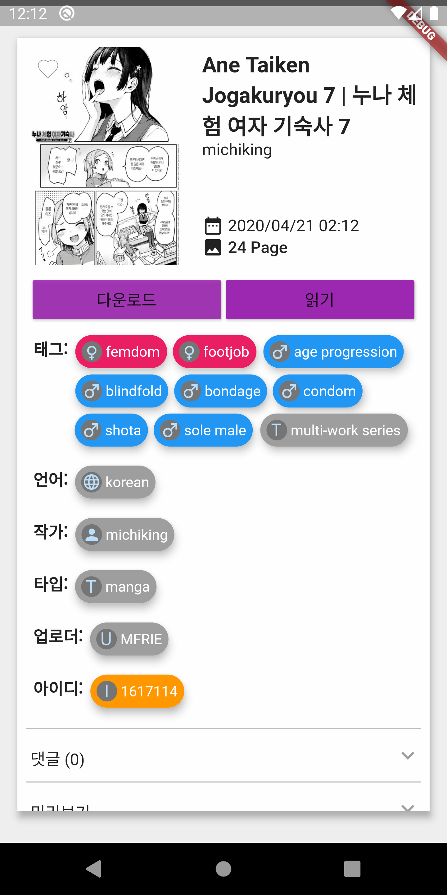
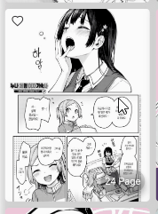

# Violet Manual [WIP]

The `Violet` application is a program designed to make it easy to access comic providing websites 
such as `E-Hentai`, `Ex-Hentai`, `Hitomi.la`, `Hiyobi.me` and `nhentai`.

In this manual, we have tried to include all the descriptions of this project and app in as much detail as possible.
There is a lot of information that users may not need, so find only what you need.

## 0. Why is our name Violet?

`Violet` is a word taken from `Violation`.

The `Violet` app is the first sub-project of `Project Violet` and is an app developed around `Image Viewer`.

The second sub-project is `Project Violet Commnunity Downloader`.
This downloader is a program under development to easily download content from video websites, blogs, galleries and communities.
This app is posted on the Play Store and is completely free without ads.
https://play.google.com/store/apps/details?id=xyz.violet.communitydownloader

## 1. Useful Features

The `Violet` app (hereinafter `Violet`) has various functions in addition to the search and viewer.
All functions are actively managed.

1. Artists Collection
2. Detailed artist/group/uploader information
3. Artist recommendation (in implementation)
4. Tag search centered on auto-completion

## 2. Database Search and Web Search

`Violet`은 작품 검색을 위한 방법으로 데이터베이스 검색과 웹 검색을 지원합니다.
데이터베이스 검색은 미리 크롤링된 데이터에서 검색하는 방식이며,
웹 검색은 직접 각 웹사이트들에서 검색하는 방법과 완전 동일하게 검색합니다.

데이터베이스 검색을 사용하는 이유는 빠른 검색(이하 쿼리)와 통계 정보 제공을 위함입니다.
이 앱은 사용자 작품 열람 기록을 바탕으로 가장 비슷한 성향을 가진 작가/그룹/업로더들을 추천해주는 시스템이 구현되어있습니다.
또한 어떤 작가/그룹/업로더와 비슷한 성향을 가진 작가/그룹/업로더들을 쉽게 탐색할 수 있는 방법을 제공합니다.

데이터베이스 검색 방식은 실시간으로 데이터가 업데이트되지 않는 단점이 있어서 실시간 검색을 지원하기 위해 
웹 검색을 부가적인 검색 방법으로 도입했습니다.
웹 검색만으로 쿼리 작업을 수행하기는 어렵기 때문에 검색 부분에서만
웹 검색을 사용하며 나머지 모든 부분들에 대해선 데이터베이스 검색을 사용합니다.

데이터베이스는 현재 수동으로 동기화하고 있으며 삼 일에 한 번 이상 업로드하도록 노력하고 있습니다.

## 3. 검색

데이터베이스 검색 모드와 웹 검색 모드 각각에서 검색 양식에 차이가 있습니다.
데이터베이스 검색은 `Hitomi.la`의 검색방식을 기반으로 하며,
웹 검색은 `E-Hentai` 검색 방식을 따릅니다.

### 3.1. 공통 검색 양식

아무 단어나 검색한다면 제목에 해당 단어가 포함되어 있는지의 여부로 검색합니다.

작품의 상세검색을 위한 `female`와 `male`, `tag`, `lang`, `series`, `artist`, `group`, `uploader`, `character`, `type`, `class` 토큰들이 있습니다.
이 토큰들은 검색하려는 작품들의 상세정보를 제한하고 싶을 때 사용할 수 있습니다.
각 토큰들은 `female:blowjob`처럼 `:`의 앞에 쓰입니다. `:`의 뒤에 쓰이는건 각 토큰들의 집합 요소(태그)입니다.
각 토큰들에 띄어쓰기가 포함된 태그가 있다면 띄어쓰기를 `_`로 바꿔써야 합니다.

`female:blowjob`로 검색하면 작품의 태그들 중 `female:blowjob`이 포함된 작품만 검색합니다.
`-female:blowjob`로 검색하면 작품의 태그들 중 `female:blowjob`이 포함되지 않는 작품만 검색합니다.

모든 토큰들은 띄어쓰기로 `And` 결합시킬 수 있습니다.
가령 `female:blowjob -female:footjob`로 검색하면 작품의 태그들 중 `female:blowjob`이 포함되어 있으며, `female:footjob`이 포함되지 않은 작품들을 검색합니다.

### 3.2. 데이터베이스 검색 양식

공통 검색 양식에서 괄호와 `Or` 검색이 포함된 검색 방법을 사용합니다.

`(female:blowjob or female:footjob) -(male:yaoi male:males_only)`와 같이 검색할 수 있습니다.
이 검색어의 의미는 작품의 태그들 중 `female:blowjob`또는 `female:footjob`이 포함되어있으며, `male:yaoi`과 `male:males_only`가 포함되지 않은 작품들을 검색합니다.

### 3.3. 웹 검색 양식

### 3.4. 검색어 자동완성

`Violet`에 구현된 자동완성 방식은 다른 앱들에 구현된 자동완성 방식들과 차이점이 있습니다.
자주 사용되는 토큰 및 태그들을 클릭 몇 번으로 쉽게 탐색할 수 있게 설계했습니다.
모든 태그들은 자주 사용되는 순으로 정렬됩니다.

하단에 배치된 백스페이스 버튼과 스페이스 버튼으로 쉽게 검색어들을 조합할 수 있습니다.

키보드로 직접 검색어를 입력하여 자동완성 목록을 찾는 것도 가능합니다.

퍼지 검색은 검색어와 일부만 일치하는 태그들을 탐색합니다.
이때 가장 일치하는 순서대로 태그들이 표시됩니다.

## 4. 작품 정보

검색 페이지나 다른 창들에서 표시되는 작품 썸네일을 탭하면 작품 정보를 상세하게 볼 수 있습니다.
작품 정보창에서 썸네일을 탭하면 꽉찬 화면으로 썸네일을 볼 수 있습니다.

`읽기` 버튼을 통해 작품을 볼 수 있으며, `다운로드` 버튼을 통해 작품을 다운로드할 수 있습니다.
작품을 다운로드하려는 경우 다운로드 전 반드시 다운로드 페이지를 로딩해야 합니다.

작가나 그룹, 업로더 태그 뱃지를 탭하면 해당 작가/그룹/업로더의 상세 정보 창으로 이동합니다.

댓글은 기본적으로 `E-Hentai`의 작품 댓글을 보여주며, 설정에서 `ExHentai` 로그인 정보를 입력한다면,
`ExHentai`의 작품 댓글을 보여줍니다.

미리보기는 작은 썸네일을 최대 30장까지 보여줍니다.

## 5. 작가/그룹/업로더 정보

작가 컬렉션이나 작품 정보창에서 작가/그룹/업로더(이하 작가) 정보를 열람할 수 있습니다.

위 세 사진 중 좌측 사진은 기본 정보창을 보여줍니다.
상단엔 작가 이름과 작품들의 태그 분포를 보여줍니다.
태그 분포를 탭하면 상세한 분포 그래프를 볼 수 있습니다.

중앙 사진은 비슷한 작가 목록 창을 보여줍니다.
가장 비슷한 작가, 점수 순으로 작가들을 나열해 보여줍니다.

우측 사진은 시리즈 목록을 보여줍니다.
비슷한 제목을 가진 작품들을 모아서 보여줍니다.

## 6. 북마크

### 6.1. 북마크 등록

 

작품썸네일을 길게 누르면 북마크를 등록/해제할 수 있습니다.
기본적으로 모든 북마크는 `미분류` 북마크 그룹에 등록됩니다.

### 6.2. 북마크 관리

북마크 페이지에서 북마크를 관리할 수 있습니다.

우측 하단 플로팅 버튼을 통해 북마크 그룹을 생성할 수 있고,
북마크 그룹을 길게 탭하여 북마크 그룹 정보를 수정할 수 있습니다.

우측 하단 플로팅 버튼에서 순서 편집을 누르면 북마크 그룹의 순서를 편집할 수 있습니다.
편집이 끝나면 다시 우측 하단 플로팅 메뉴 버튼에서 순서 편집을 눌러 순서 편집을 종료하세요.

## 7. 필터

검색창 및 북마크 그룹 페이지에서 필터 기능을 사용할 수 있습니다.

필터 기능을 사용하면 필터에서 선택된 태그가 포함된 작품들만 보여줍니다.

## 8. 다운로드

다운로드 탭에서 직접 URL을 입력해 `Hitomi.la` 작품과 `인스타그램`, `픽시브` 계정의 컨텐츠를 다운로드할 수 있습니다.
`픽시브`는 설정창에서 로그인이 필요합니다.

## 9. 작가 컬렉션

작가 컬렉션은 홈 화면의 `Artists Collection!`을 통해 확인할 수 있습니다.
전체 작가 목록은 아래 URL에서 확인해주세요.

https://github.com/project-violet/violet/blob/dev/lib/component/hitomi/artists.dart

## 10. 향후 계획

완벽한 웹 검색 지원을 1.0 버전 목표로하고 있습니다.